<picture>
  <source media="(prefers-color-scheme: dark)" srcset="./assets/rockin-logo-dark.svg">
  <source media="(prefers-color-scheme: light)" srcset="./assets/rockin-logo-light.svg">
  
</picture>

**Secure, reproducible AI engineering from idea to verified result.**

AI Systems · Apps · AI Agents · Skills · Automation · Cloud Workflows

`GitHub` · `GitHub Actions` · `Vercel` · `TypeScript` · `Next.js` · `Python` · `PowerShell`

### GitHub Achievements

<picture>
  <source media="(prefers-color-scheme: dark)" srcset="./assets/github-achievements-motion.svg">
  <source media="(prefers-color-scheme: light)" srcset="./assets/github-achievements-motion-light.svg">
  
</picture>

Pull Shark ×3 · Pair Extraordinaire · YOLO · Quickdraw

[Rights & usage](./RIGHTS.md)

